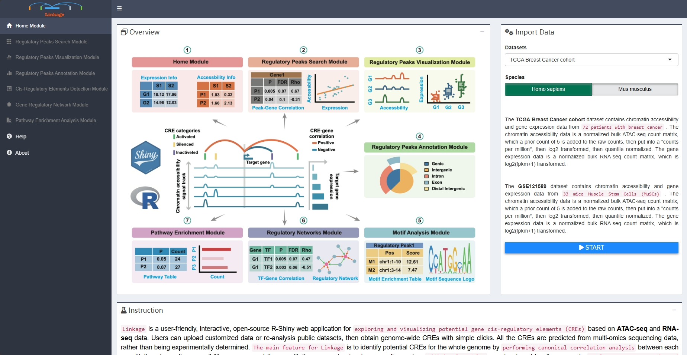
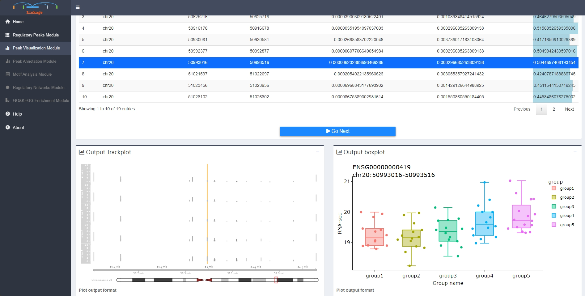
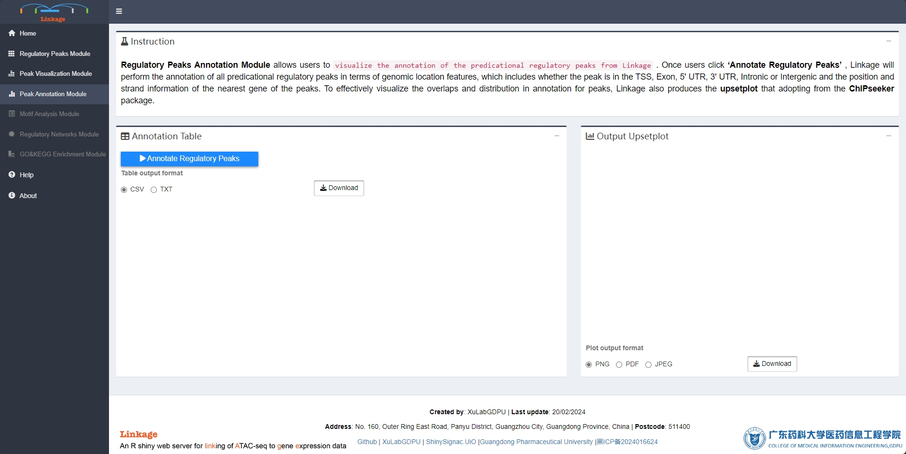

``` r
library(linkage)
Linkage.UIO()
```

### **Data input**

::: {align="justify"}
The ***TCGA Breast Cancer cohort*** dataset contains chromatin accessibility and gene expression data from 72 patients with breast cancer. The chromatin accessibility data is a normalized bulk ATAC-seq count matrix, which a prior count of 5 is added to the raw counts, then put into a "counts per million", then log2 transformed, then quantile normalized. The gene expression data is a normalized bulk RNA-seq count matrix, which is log2(fpkm+1) transformed.
:::

::: {align="justify"}
The ***GSE121589*** dataset contains chromatin accessibility and gene expression data from 33 mice Muscle Stem Cells (MuSCs). The chromatin accessibility data is a normalized bulk ATAC-seq count matrix, which a prior count of 5 is added to the raw counts, then put into a "counts per million", then log2 transformed, then quantile normalized. The gene expression data is a normalized bulk RNA-seq count matrix, which is log2(fpkm+1) transformed.
:::

::: {align="justify"}
Two tab-delimited text/csv input files (chromatin accessibility matrix and gene expression matrix) are required before running Linkage. The gene expression matrix file is a tab-delimited multi-column data matrix, which the first column represents gene symbols and the following columns represent normalized or raw expression levels of genes for each sample. The chromatin accessibility matrix file is a tab-delimited multi-column data matrix as well, which the first three columns represent chromosome name, start coordinate on the chromosome and end coordinate on the chromosome of the peaks respectively; the remaining columns of the chromatin accessibility matrix file represent normalized or raw chromatin accessibility levels of peaks for each sample. **Each element of ready-to-analysis files will appear in Chromatin Accessibility Matrix panel and Gene Expression Matrix panel.**
:::



### **Regulatory Peaks Search Module**

::: {align="justify"}
**Regulatory Peaks Search Module** allows users to detect all potential regulatory DNA regions for specific genes. When given an **input gene** and **targeting DNA regions**, Linkage will automatically perform **canonical correlation analysis** between each quantitative chromatin accessibility measure in the region and the quantitative expression level of the gene across all samples. Users can easily adjust the region of interest and customize the correlation algorithm (**Spearman** / **Pearson** / **Kendall**). Then, all the statistically significant results are listed in the Potential Cis-regulatory Regions panel. With clicking on a specific region of this panel, users can view the scatter plot of quantitative chromatin accessibility and gene expression from the Correlation Plot panel. The **rho** and **FDR** for correlation analysis also be shown on the scatter plot.
:::


### **Regulatory Peaks Visualization Module**

::: {align="justify"}
**Regulatory Peaks Visualization Module** allows users to visualize the coverage of mapped ATAC-seq reads around a given specific regulatory peak, as well as the corresponding quantitative expression of the target gene of this regulatory peak. Users initially **select a regulatory peak** that obtained from the Regulatory Peaks Detection Module. Linkage then categorizes samples into five groups based on the quantitative chromatin accessibility of the specific regulatory peak, ranging from low to high for each individual sample. The **coverage track of mapped ATAC-seq reads** and the **boxplot of the target gene** for each group will be shown simultaneously.
:::



### **Regulatory Peaks Annotation Module**

::: {align="justify"}
**Regulatory Peaks Annotation Module** allows users to visualize the annotation of the predicational regulatory peaks from Linkage. Once users click **'Annotate Regulatory Peaks'**, Linkage will perform the annotation of all predicational regulatory peaks in terms of genomic location features, which includes whether the peak is in the TSS, Exon, 5' UTR, 3' UTR, Intronic or Intergenic and the position and strand information of the nearest gene of the peaks. To effectively visualize the overlaps and distribution in annotation for peaks, Linkage also produces the **upsetplot** that adopting from the **ChIPseeker** package.
:::



### **Motif Analysis Module**

::: {align="justify"}
**Motif Analysis Module** supports users to visualize the enriched transcription factor motifs within potential regulatory peaks. With clicking on a specific peak, users can view the location and binding score information of each enriched transcription factor of this region. Once users select one of the transcription factors, the corresponding **sequence logo** of this cis-regulatory element will appear in the Sequence-logo Plot panel.
:::


### **Regulatory Network Module**

::: {align="justify"}
**Regulatory Network Module** helps users to visualize GRNs that nodes are genes and corresponding cis-regulatory elements，which inferred from previous analysis of Linkage. First, users can input a list of interested genes or upload a gene-list file that obtained from the previous analysis. Then users can adjust a series of parameters that related to building the GRN, including types of gene symbols, calculation methods and thresholds of interactions between the nodes (edges of the GRNs). Once users click **'Build Network'**, Linkage will perform canonical correlation analysis of quantitative expression level between each interested gene and their potential cis-regulatory elements. The significant calculation results of correlation analysis are shown in the Gene-TF Table panel. Meanwhile, Linkage produces the corresponding informatic and interactive GRN that adopting from the **visNetwork** package. Users can further easily change network layouts, select subnetworks, and save the GRN as spreadsheets with interaction score or plots.
:::

 

### **Pathway Enrichment Module**

::: {align="justify"}
**Pathway Enrichment Module** supports users to visualize tabular and graphical pathway enrichment results of interested gene lists, which can be produced from previous analysis of Linkage. The enrichment analysis can link these gene lists with underlying molecular pathways and functional categories such as **gene ontology (GO)** and **Kyoto Encyclopedia of Genes and Genomes (KEGG)**.
:::

 
